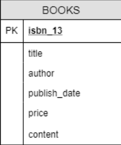
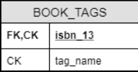

<<<<<<< HEAD
# PubHub 🕮 
### Book Publishing System
<br>
<a href="CODE_OF_CONDUCT.md">
    
</a>

---
=======
# PubHub 🕮  
Book Publishing System
>>>>>>> cdb2866658917b9b17d2a340e1f33a814b00d5fb

A self-publishing platform that allows anyone to write, publish, and sell their own books.

## Setting Up Local Environment
The following instructions will help you set up a local development environment, run the project on your machine for development and testing purposes, and deploy it on a live system. See [*Deployment*](https://github.com/jtanaeki/PubHub/blob/main/README.md#deployment) for notes on how to deploy the project. See [*How to Discuss and Contribute*](https://github.com/jtanaeki/PubHub#how-to-discuss-and-contribute) for notes on how to contribute to this repository.

### Prerequisites
Before building and testing the application, you must make sure to have the following installed:
- The [latest version of Java Runtime Environment (JRE)](https://www.oracle.com/java/technologies/javase-jre8-downloads.html) (Using JRE 1.8, rather than JDK, maybe more suitable for this application to run on WildFly)
- Any IDE that supports JRE development, such as the [latest version of Eclipse](https://www.eclipse.org/downloads/packages/) (Download and install Eclipse IDE for Enterprise Java and Web Developers)
- Application Server, such as the [latest version of WildFly](https://www.wildfly.org/downloads/) (Please read [*Java Development Environment Setup*](Java%Development%Environment%Setup.pdf) to see how to integrate Wildfly with Eclipse)
- Database, such as the [latest version of PostgreSQL](https://www.enterprisedb.com/downloads/postgres-postgresql-downloads)

For further instruction on setting up your environment for Java development, read [*Java Development Environment Setup*](Java%Development%Environment%Setup.pdf).

\* *Please keep in mind that these instructions were constructed around 2016.*

### Cloning the Repository
After installing the necessary software, you can clone a local copy of the repository. A [ZIP file version](https://github.com/jtanaeki/PubHub/archive/refs/heads/main.zip) of the copy can be downloaded, or you can clone the repository directly over HTTPS from the command line:

```bash
git clone https://github.com/jtanaeki/PubHub.git
```

### Tables in Database
\


## Running the Application
The following instructions will help you get the program running via Eclipse.

### Importing the Project
(IMAGES AT https://www.codejava.net/ides/eclipse/import-existing-projects-into-eclipse-workspace)
- The Import function can be accessed in three ways:
  - The most convenient and quickest way: **File > Import…** (shortcut: **Alt + F + I**):

        (IMAGE)

  - Right click on any blank space in *Package Explorer* view, select **Import…** from the context menu:

        (IMAGE)

  - Right click on any blank space in Project Explorer view, then select **Import > Import…** from the context menu:

        (IMAGE)

- The **Import** wizard should open:

       (IMAGE)

- Under the *General* folder, select *Existing Projects into Workspace* and click **Next**. The next screen, **Import Projects**, appears:

       (IMAGE)

- If the application was downloaded as a zip file, click **Select archive file** and click the **Browse** button to locate the zip file. Make sure the project is selected and click **Finish**:

       (IMAGE)

- If the application was NOT downloaded as a zip file, click **Select root directory** and click the **Browse** button to find the project’s directory path. Make sure the project and the *Copy projects into workspace* option is selected:

       (IMAGE)

- The archive will be extracted and the files will be copied into the workspace. The imported project should show in the *Project Explorer/Package Explorer* view:

       (IMAGE)

## Deployment
### Adding JRE System Library to Java Build Path
If you don't see the JRE System Library with JRE 1.8 in the Java Build Path, under the project name, in the Package Explorer tab, then it must be added.

(IMAGES IN PUBHUB_SCREENSHOTS FOLDER ON DESKTOP)
- Right-click the project folder and click *Properties*

       (IMAGE)

- Click *Java Build Path* in the left-hand side of the dialog box, then click the *Libraries* tab

       (IMAGE)
  
### Integrating the Application Server (Wildfly) with the IDE (Eclipse)
If you have not done so yet, make sure Wildfly is set up on Eclipse for deployment. Please read [*Java Development Environment Setup*](Java%Development%Environment%Setup.pdf). Follow the instructions in the *Integrating Your Application Server with Your IDE (JBoss Middleware)* section.

### Setting up the Database
Please read [*Java Development Environment Setup*](Java%Development%Environment%Setup.pdf) to see how to set up PostgreSQL. Follow the instructions in the *Installing a Database (PostgreSQL)* section. Create [these tables](https://github.com/jtanaeki/PubHub#tables-in-database) in the database and fill in random values.
